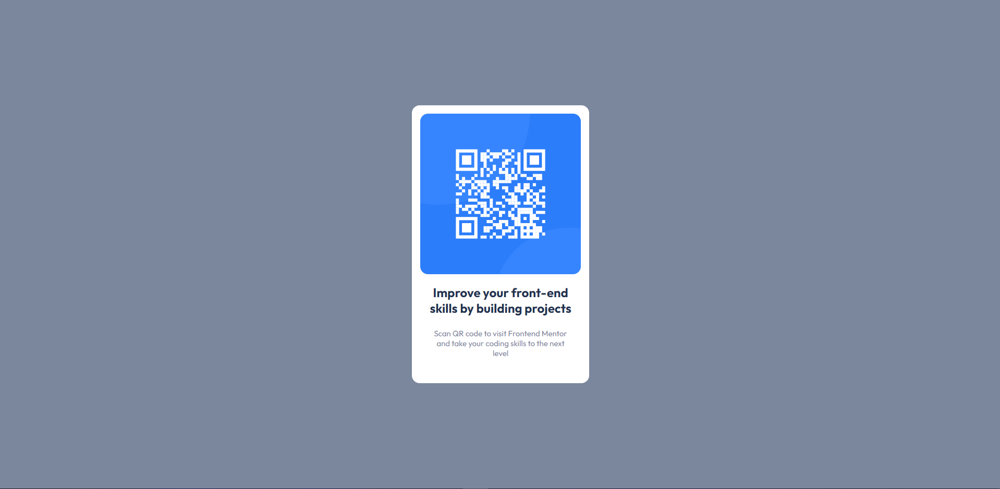

# Frontend Mentor - QR code component solution

This is a solution to the [QR code component challenge on Frontend Mentor](https://www.frontendmentor.io/challenges/qr-code-component-iux_sIO_H). Frontend Mentor challenges help you improve your coding skills by building realistic projects.

## Table of contents

-   [Overview](#overview)
    -   [Screenshot](#screenshot)
-   [My process](#my-process)
    -   [Built with](#built-with)
    -   [Useful resources](#useful-resources)
-   [Author](#author)

**Note: Delete this note and update the table of contents based on what sections you keep.**

## Overview

### Screenshot

### Links

-   Live Site URL: [https://qr-code-indol-one.vercel.app/](https://qr-code-indol-one.vercel.app/)

## My process

### Built with

-   Semantic HTML5 markup
-   CSS custom properties
-   Flexbox

### Useful resources

-   [Flexbox](https://css-tricks.com/snippets/css/a-guide-to-flexbox/) - The resource that allows you to understand all the properties of flexbox.

## Author

-   Frontend Mentor - [@Bogdanvosk](https://www.frontendmentor.io/profile/Bogdanvosk)
-   Github - [@Bogdanvosk](https://github.com/Bogdanvosk)
